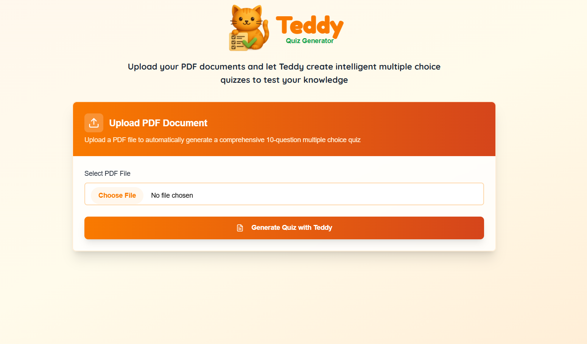
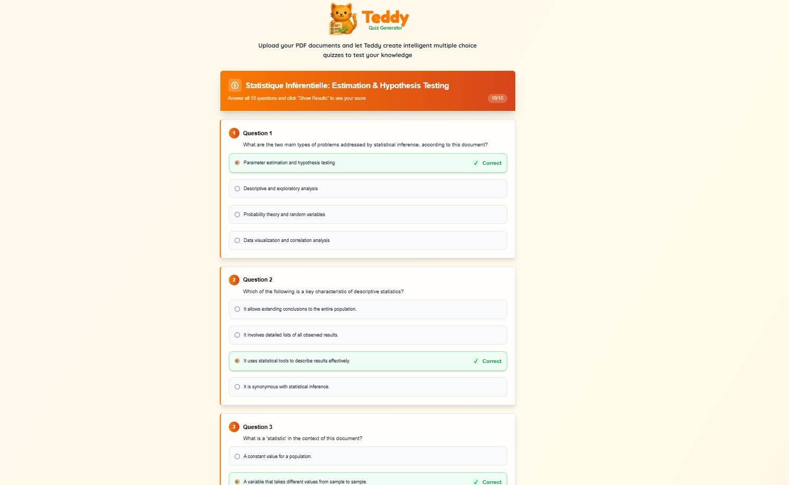

  

**Teddy is an AI-powered quiz generator that automatically creates quizzes from PDF documents using Google's Gemini 2.0 (Flash Pro). Built for speed and accuracy, Teddy extracts key concepts from PDFs and transforms them into high-quality quiz questions. The app is deployed on Vercel for fast, serverless access and seamless user experience.**

